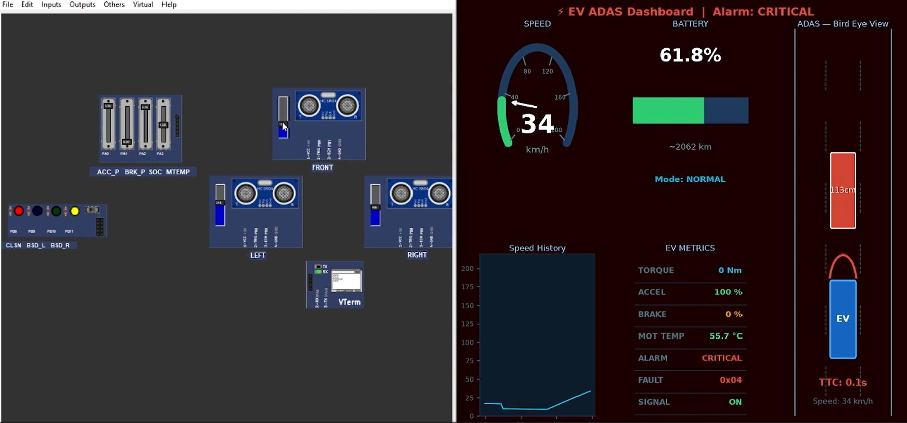

# 🚗 EV ADAS System using STM32

An **Advanced Driver Assistance System (ADAS)** for an **Electric Vehicle (EV)** implemented using the **STM32F103C8T6 (Blue Pill)** microcontroller. The project simulates essential ADAS features such as **Forward Collision Warning (FCW)**, **Blind Spot Detection (BSD)**, **Fault Monitoring**, **Drive Mode Management**, and **Real-Time Vehicle Monitoring**.

The system is integrated with **PICSimLab** for hardware simulation and a **Python-based Dashboard** for live visualization of vehicle parameters.

---

#  Project Overview

This project demonstrates the implementation of an Electric Vehicle ADAS system capable of monitoring vehicle status, detecting nearby obstacles, estimating collision risks, and managing vehicle safety.

The system provides:

-  Real-time vehicle dynamics simulation
-  Collision warning system
-  Blind spot detection
-  Battery monitoring
-  Motor temperature monitoring
-  Live Python dashboard
-  UART command interface
-  Fault management system

---

# Features

## Electric Vehicle Dynamics

- Accelerator Pedal Input
- Brake Pedal Input
- Vehicle Speed Simulation
- Battery State of Charge (SOC)
- Torque Calculation
- Power Calculation
- Estimated Driving Range
- Motor Temperature Monitoring

---

##  ADAS Features

### Forward Collision Warning (FCW)

- Front obstacle detection
- Time-To-Collision (TTC) calculation
- Collision risk classification
- Warning generation

### Blind Spot Detection (BSD)

- Left blind spot monitoring
- Right blind spot monitoring
- LED indication

---

##  Fault Management

The system continuously monitors for critical faults such as:

- Motor Overheating
- Critical Low Battery
- Critical Collision Risk

When a critical fault is detected, the vehicle automatically enters a **Safe State**.

---

##  User Interface

- UART Command Shell
- PICSimLab Virtual Terminal
- Python Real-Time Dashboard

---

##  Drive Modes

Three drive modes are supported:

| Mode | Description |
|------|-------------|
| **ECO** | Maximum efficiency and battery saving |
| **NORMAL** | Balanced performance |
| **SPORT** | Maximum performance |

---

#  Hardware Used

## Microcontroller

- STM32F103C8T6 (Blue Pill)

---

## Sensors

- HC-SR04 Ultrasonic Sensor (Front)
- HC-SR04 Ultrasonic Sensor (Left)
- HC-SR04 Ultrasonic Sensor (Right)

---

## Inputs

- Accelerator Potentiometer
- Brake Potentiometer
- SOC Potentiometer
- Motor Temperature Potentiometer

---

## Outputs

- Collision Warning LED
- Blind Spot Left LED
- Blind Spot Right LED

---

# Software Used

- STM32CubeIDE
- STM32 HAL Library
- PICSimLab
- Python 3.x
- PySerial
- Tkinter
- Matplotlib

---

#  Project Structure

```
EV_ADAS_System/
│
├── Core/
├── Drivers/
├── Docs/
├── Images/
├── PICSimLab/
├── Python_Dashboard/
│   ├── ev_dashboard.py
│   └── requirements.txt
│
├── README.md
└── LICENSE
```

---

#  Getting Started

## 1️. STM32 Firmware

Open the project in **STM32CubeIDE**.

Build the project.

Flash it to the STM32 board or run it using **PICSimLab**.

---

## 2️. Python Dashboard

Navigate to the dashboard folder.

```bash
cd Python_Dashboard
```

Install the required Python libraries.

```bash
pip install -r requirements.txt
```

Run the dashboard.

```bash
python ev_dashboard.py
```

---

# UART Commands

| Command | Description |
|----------|-------------|
| `help` | Display available commands |
| `status` | Show complete system status |
| `mode eco` | Set ECO mode |
| `mode normal` | Set NORMAL mode |
| `mode sport` | Set SPORT mode |
| `speed set X` | Set vehicle speed |
| `soc set X` | Set battery SOC |
| `temp set X` | Set motor temperature |
| `obstacle X` | Set front obstacle distance |
| `obstacle clear` | Remove obstacle |
| `fault inject motor` | Inject motor overheat fault |
| `fault inject soc` | Inject battery fault |
| `fault inject col` | Inject collision fault |
| `fault clear` | Clear all faults |
| `reset` | Reset the system |

---

#  Screenshots

Place the following images inside the **Images/** folder.

```
Images/
│
├── system_overview.png
├── picsimlab_simulation.png
├── python_dashboard.png
├── collision_warning.png
├── blind_spot_detection.png
└── virtual_terminal.png
```

Then display them in the README using:

```markdown
## System Overview


---

## PICSimLab Simulation


---

## Python Dashboard


---

## Collision Warning



---

## Blind Spot Detection


---

## Virtual Terminal


```

---

#  System Workflow

```
Driver Inputs
      │
      ▼
STM32 Controller
      │
      ├─────────────► EV Dynamics
      │
      ├─────────────► ADAS Algorithms
      │
      ├─────────────► Fault Management
      │
      ├─────────────► UART Terminal
      │
      ▼
Python Dashboard
      │
      ▼
Real-Time Monitoring
```

---

#  Future Scope

The project can be extended with:

- Lane Departure Warning
- Adaptive Cruise Control
- Automatic Emergency Braking (AEB)
- Camera-based Object Detection
- CAN Bus Communication
- AI-assisted Driver Monitoring
- Vehicle-to-Vehicle (V2V) Communication
- Vehicle-to-Infrastructure (V2I) Communication
- GPS Navigation Integration
- Cloud-based Vehicle Analytics

---

#  Author

**Malavika**

Department of Electronics and Communication Engineering

TKM College of Engineering

---

#  License

This project is intended for **educational and research purposes**.

Feel free to modify and extend it for learning and academic use.

---

#  Support

If you found this project useful:

⭐ Star this repository

🍴 Fork the repository

🛠️ Contribute by submitting Pull Requests

---
